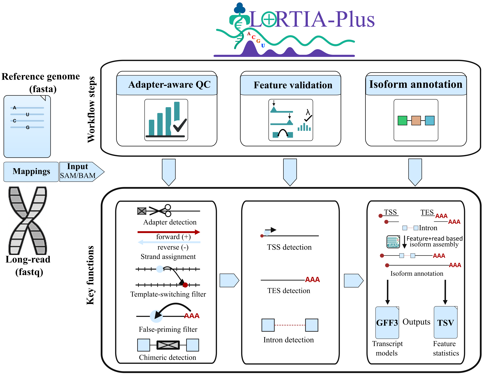

# LoRTIA-Plus - Long-read RNA-Seq Transcript Isoform Annotator toolkit

<p align="center">
  
</p>

LoRTIA-Plus is an extended version of the original LoRTIA toolkit for the annotation of transcript features such as transcription start sites (TSS), transcription end sites (TES), introns, and transcript isoforms from long-read RNA sequencing data. The toolkit expects `SAM` or `BAM` files as input and produces `GFF` files as well as other processed files as outputs. The sequencing reads can stem from any long-read sequencing platform, including Oxford Nanopore and PacBio. As long as the reads contain features that allow reliable identification of transcript ends, complete isoform annotation is possible.

`SAM` or `BAM` files can be produced by any mapper. However, when mapping with [minimap2], either run minimap2 with the `-Y` option or filter out secondary alignments before using LoRTIA-Plus. The toolkit was developed to run in UNIX environments.

<p align="center">
  
</p>

## Project history

LoRTIA-Plus is based on the original LoRTIA toolkit developed by [Zsolt Balázs]. This repository was created to maintain and distribute an extended version of the software, including direct RNA-seq support and transcript annotation performance improvements.

## What is new in LoRTIA-Plus

Compared with the original LoRTIA release, LoRTIA-Plus includes:

- support for Oxford Nanopore direct RNA-seq data via `--dRNA`
- faster transcript annotation through `polars`-based processing
- updated repository structure and documentation

## Contents

- [Project history](#project-history)
- [What is new in LoRTIA-Plus](#what-is-new-in-lortia-plus)
- [Installation](#installation)
- [Dependencies](#dependencies)
- [Usage](#usage)
- [Wiki](#wiki)
- [Credits](#credits)
- [Citation](#citation)

## <a name="installation"></a>Installation

Clone the repository:

```sh
git clone https://github.com/philipmories/LoRTIA-Plus
cd LoRTIA-Plus/LoRTIA_Plus
chmod 755 LoRTIA

Make sure all dependencies are installed and available in your `PATH`.

## <a name="dependencies"></a>Dependencies

- [samtools] (required for sorting, indexing, and coverage calculation; make sure that `samtools` is available in your `PATH`)
- [bedtools] (tested v. 2.28; make sure that `bedtools` is available in your `PATH`)
- [pandas] (tested v. 0.24.0 and up)
- [polars]
- [Biopython] (tested Release 1.73)
- [pysam] (tested v. 0.15.0)
- [scipy] (tested v. 1.2.2)

If the dependencies are installed and LoRTIA is available in your `PATH`, typing `LoRTIA -h` should show the help menu.

## <a name="usage"></a>Usage

The following examples show how to determine isoforms from an `alignments.sam` file mapped to `reference.fasta`. The annotations and other processed files will be generated in `output_folder` using the prefix of the input `SAM` file.

When running the LoRTIA pipeline, you have to specify the adapter configuration used during library preparation.

The [Lexogen Telo Prime cap selection kit] is the default adapter set of the pipeline. If your sample was prepared with this kit, type:

```sh
LoRTIA -s poisson -f True /path/to/alignments.sam /path/to/output_folder /path/to/reference.fasta
```

If your library was prepared using [PacBio Isoseq], type:

```sh
LoRTIA -5 AGAGTACATGGG --five_score 16 --check_in_soft 15 -3 AAAAAAAAAAAAAAA --three_score 18 -s poisson -f True /path/to/alignments.sam /path/to/output_folder /path/to/reference.fasta
```

If your library was prepared using standard [Nanopore cDNA-Seq adapters], type:

```sh
LoRTIA -5 TGCCATTAGGCCGGG --five_score 16 --check_in_soft 15 -3 AAAAAAAAAAAAAAA --three_score 16 -s poisson -f True /path/to/alignments.sam /path/to/output_folder /path/to/reference.fasta
```

If your library was prepared using Oxford Nanopore direct RNA-seq (dRNA-seq), type:

```sh
LoRTIA --dRNA --check_in_soft 6 -3 AAAA --three_score 6 -s poisson -f True /path/to/alignments.sam /path/to/output_folder /path/to/reference.fasta
```

In `--dRNA` mode, LoRTIA-Plus does not perform 5′ adapter detection. Instead, it uses mapper-derived strand information, marks the true 5′ end as accepted, and performs 3′ end quality control only on the true 3′ end. This mode is recommended for Oxford Nanopore direct RNA-seq libraries.

If your library uses a different adapter design, specify the appropriate adapter sequences and score thresholds manually when running the program.

For more details, see the [Wiki].

## <a name="credits"></a>Credits

The original LoRTIA toolkit was developed by [Zsolt Balázs].

LoRTIA-Plus extends the original toolkit with additional functionality, including:

- support for direct RNA-seq data
- transcript annotation speedups using `polars`
- updated documentation and repository maintenance

Discussions and earlier work with Attila Szűcs (University of Szeged) contributed substantially to the development of the original toolkit. The early code was commented on by Tibor Nagy (University of Debrecen). Special thanks to the Department of Medical Biology at the University of Szeged for early testing and feedback.

## <a name="citation"></a>Citation

If you use LoRTIA-Plus in your work, please cite:

- the original LoRTIA publication and/or repository
- the LoRTIA-Plus publication, when available

[minimap2]: https://github.com/lh3/minimap2
[samtools]: https://www.htslib.org/
[bedtools]: https://bedtools.readthedocs.io/en/latest/content/installation.html
[pandas]: https://pandas.pydata.org/pandas-docs/stable/install.html
[polars]: https://pola.rs/
[Biopython]: http://biopython.org/DIST/docs/install/Installation.html
[pysam]: https://pysam.readthedocs.io/en/latest/installation.html
[scipy]: https://www.scipy.org/install.html
[Lexogen Telo Prime cap selection kit]: https://www.lexogen.com/wp-content/uploads/2015/03/013PF032V0100_TeloPrime.pdf
[PacBio Isoseq]: https://www.pacb.com/blog/introduction-of-the-iso-seq-method-state-of-the-art-for-full-length-transcriptome-sequencing/
[Nanopore cDNA-Seq adapters]: https://nanoporetech.com/resource-centre/guide-cdna-sequencing-oxford-nanopore
[Wiki]: https://github.com/zsolt-balazs/LoRTIA/wiki
[Zsolt Balázs]: https://github.com/zsolt-balazs/
